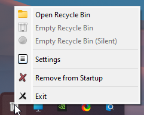
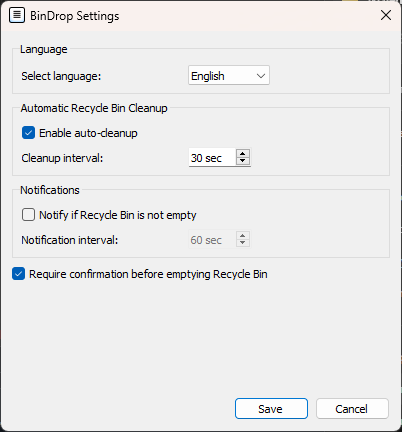

# 🖥️ **BinDrop** - Basket in your tray
## Choose Your Language README

  <table>
    <tr>
      <td align="center">
        <a href="docs/README.en.md">
          
           English
        </a>
      </td>
      <td align="center">
        <a href="docs/README.ru.md">
          
           Русский
        </a>
      </td>
    </tr>
  </table>

## 🌟 Main Features

  <table>
    <tr>
      <td align="center">
         
        <b>🔧 Program Menu</b> 
        Launch the program, perform a manual cleanup, a silent cleanup, or add it to startup.
      </td>
      <td align="center">
         
        <b>📸 Program Settings</b> 
        Customize the program's behavior to suit your preferences.
      </td>
    </tr>
  </table>

## 📥 Download

| 📂 **Download Options**        | 🌐 **Link**                                                                                 |
|--------------------------------|----------------------------------------------------------------------------------------------|
| **Download**    				 | [Download Now](https://github.com/Farmerok/BinDrop/releases/latest)                 |
| **Other Releases & Changelog** | [View Releases](https://github.com/Farmerok/BinDrop/releases)                       |

---

## 📇 Contact Information

| 💬 **Get in Touch**            | 🌐 **Link**                                                                                 |
|--------------------------------|----------------------------------------------------------------------------------------------|
| **Telegram**                   | [Contact on Telegram](https://t.me/insiderkeeps)                                             |