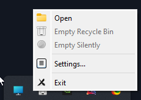
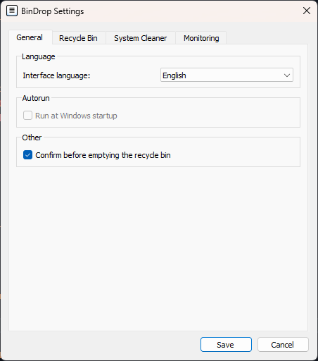
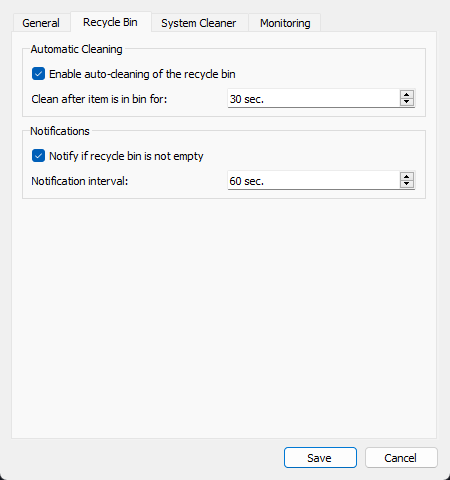
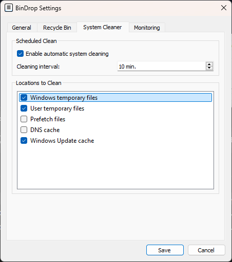

## 🌟 Hauptfunktionen

**BinDrop** hilft Ihnen, den Papierkorb, Systemdateien und Windows-Einstellungen direkt aus dem Systemtray einfach zu verwalten:

  <table>
    <tr>
      <td align="center" valign="top" style="padding: 15px;">
          
        <b>📥 Verwaltung über das Systemtray</b> 
        - Ein-Klick-Bereinigung: bestätigter oder stiller Modus. 
        - Autostart: die Anwendung startet mit Windows und ist jederzeit einsatzbereit.
      </td>
      <td align="center" valign="top" style="padding: 15px;">
          
        <b>🔧 Allgemeine Einstellungen</b> 
        - Passen Sie das Verhalten der Anwendung an Ihre Vorlieben an. 
        - Sprachauswahl: Russisch, Englisch, Ukrainisch und weitere. 
        - Intervall für Bereinigung und Benachrichtigungen einstellen.
      </td>
      <td align="center" valign="top" style="padding: 15px;">
          
        <b>📸 Papierkorb-Kontrolle</b> 
        - Automatische geplante Bereinigung. 
        - Verwaltung der Bereinigungsintervalle. 
        - Benachrichtigungen erhalten, wenn der Papierkorb voll ist.
      </td>
      <td align="center" valign="top" style="padding: 15px;">
          
        <b>🧹 Systembereinigung</b> 
        - Automatische Bereinigung von Dateien und Caches verwalten. 
        - Systemordner für optimale Leistung auswählen. 
        - Halten Sie Desktop und System sauber.
      </td>
    </tr>
  </table>

