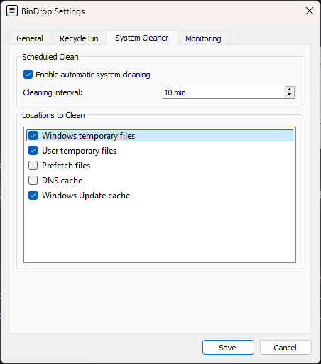

## 🌟 Key Features

**BinDrop** makes it easy to manage your Recycle Bin, system files, and Windows settings directly from the system tray:

  <table>
    <tr>
      <td align="center" valign="top" style="padding: 15px;">
          
        <b>📥 System Tray Management</b> 
        - One-click cleanup: confirmed or silent mode. 
        - Autostart: the app launches with Windows and is always ready to work.
      </td>
      <td align="center" valign="top" style="padding: 15px;">
          
        <b>🔧 General Settings</b> 
        - Customize app behavior to your preferences. 
        - Language selection: Russian, English, Ukrainian, and more. 
        - Configure cleanup intervals and notifications.
      </td>
      <td align="center" valign="top" style="padding: 15px;">
          
        <b>📸 Recycle Bin Control</b> 
        - Automatic scheduled cleanup. 
        - Manage cleanup intervals. 
        - Receive notifications when the Recycle Bin is full.
      </td>
      <td align="center" valign="top" style="padding: 15px;">
          
        <b>🧹 System Cleanup</b> 
        - Manage automatic cleaning of files and caches. 
        - Select system folders for optimal performance. 
        - Keep your desktop and system tidy.
      </td>
    </tr>
  </table>

